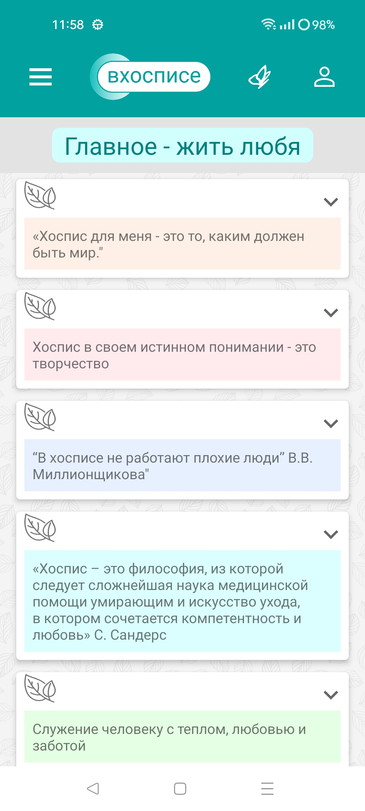
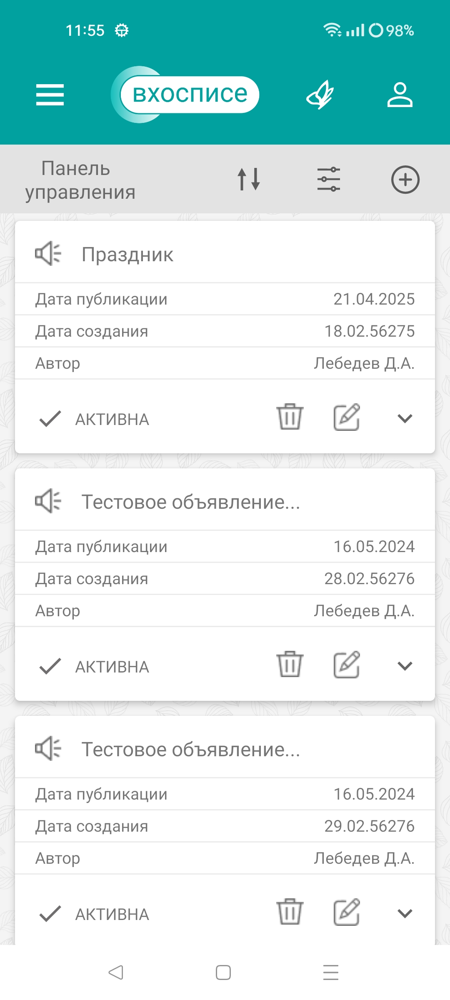

# План по проверке и автоматизации приложения «Мобильный хоспис»

## Описание приложения:
Приложение на базе операционной системы android включает в себя:
- новостную сводку хосписа
- тематические цитаты.

Приложение включает в себя следующие разделы:

- Раздел Авторизации 

- Раздел Главная с разделом Новости

- Меню со списком функций.

- Тематические цитаты (бабочка).

- Выход из приложения (человек).

- Раздел Новости с дополнительными экранами: панель управления новостями, переключение на последнее созданное сообщение, фильтрация, создание новости.

- Раздел правовой и технической информации (О приложении).

### Список функций приложения.

- авторизация в приложении, выход из профиля
- просмотр новостей на главной странице приложения
- просмотр новостей, создание новостей, редактирование новостей, удаление новостей, фильтрация и сортировка новостей
- просмотр тематических цитат
- открытие web-view страницы конфиденциальности и пользовательского соглашения.

### Что будем проверять.

## Проведение ручного тестирования:

**Виды тестирования:**
1. Функциональное тестирование приложение с тестированием аппаратной части устройства Realme 11, версия android 13
1. Тестирование UI/UX: разные параметры экрана в панели разработчика устройства, соответсвие гайдлайну google
1. Тестирование в условиях ограниченности ресурсов с помощью панели разработчика устройства, а также на эмуляторе в android studio

Интеграционное тестирование на предмет установки/обновления приложения не провести в связи с его отсутствием в сторах.

## Проведение автоматизированного тестирования:

1. Автоматизация функциональных тестов приложения будет произведена с помощью Espresso, так как данный фреймворк наиболее удобен в использовании: 
- уже установлен в Android Studio
- все зависимости подтянуты, их необходимо только проверить
- наличие Recorder для создания основы теста 

## Перечень автоматизированных сценариев:

*Страница авторизации*
1.Успешная авторизация в приложении и выход из профиля
1. Авторизация невалидного пользователя при использовании регистра
1. Авторизация при введении в поле логин символов на кириллице
1. Авторизация при введении в поле логин спецсимволов
1. Авторизация при введении в поле логин 1 символа
1. Авторизация при введении в поле логин 30 символов
1. Авторизация при введении в поле пароль символов на кириллице
1. Авторизация при введении в поле пароль спецсимволов
1. Авторизация при введении в поле пароль 1 символа
1. Авторизация при введении в поле пароль 30 символов
1. Авторизация с пустым логином
1. Авторизация с пустым паролем
1. Авторизация с пустым логином и паролем

*Новости*
1. Успешное создание новости
1. Создание новости с датой публикации в прошлом
1. Создание новости с датой публикации в будущем
1. Создание новости с пустыми полями
1. Редактирование новости
1. Удаление новости

*Тематические статьи*
1. Просмотр тематических статей

*О приложении*
1. Просмотр политики конфиденциальности
1. Просмотр пользовательского соглашения

## Перечень используемых инструментов и устройств:
1. Система хранения версий git и удаленное хранилище репозиториев GitHub
1. Android Studio - интегрированная среда разработки (IDE) для работы с платформой Android
1. Фреймворк allure для построения отчетности
1. Фреймворк для автоматизированного тестирования Espresso
1. Встроенный в Android Studio эмулятор устройств на базе android Pixel 4 API 29
1. Устройство Realme 11, версия android 13

## Риски тестирования:
1. Пропустить баги в результате скудного арсенала устройств
2. Не стабильная работа эмуляторов Android Studio, необходимость их время от времени создавать заново и перезагружать.
3. Не покрыть весь необходимый функционал проверками 
1. Технические неполадки на устройстве Realme 11
1. Ошибки написания автоматизированных тестов
1. Не уложиться в сроки сдачи работы 

### Интервальная оценка с учетом рисков

Общее время на тестирование и автоматизацию может колебаться в пределах от 90 до 130 часов. Учитывая возможные риски и неопределенности, необходимо предусмотреть дополнительный резерв времени, чтобы компенсировать возможные задержки или неожиданные проблемы.
Таким образом, общая интервальная оценка с учетом рисков составляет примерно от 108 до 156 часов.